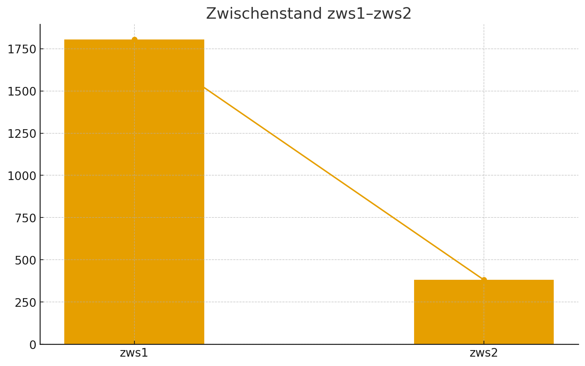
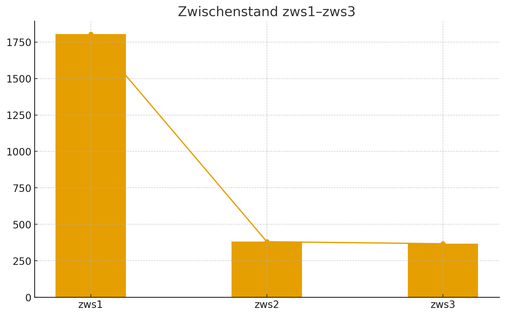
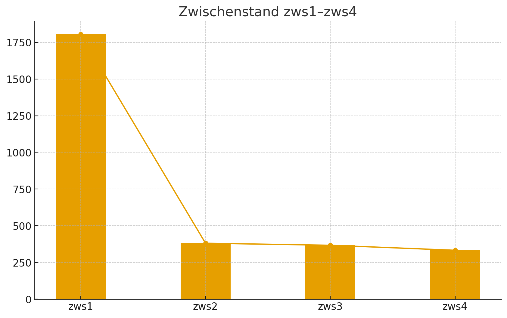
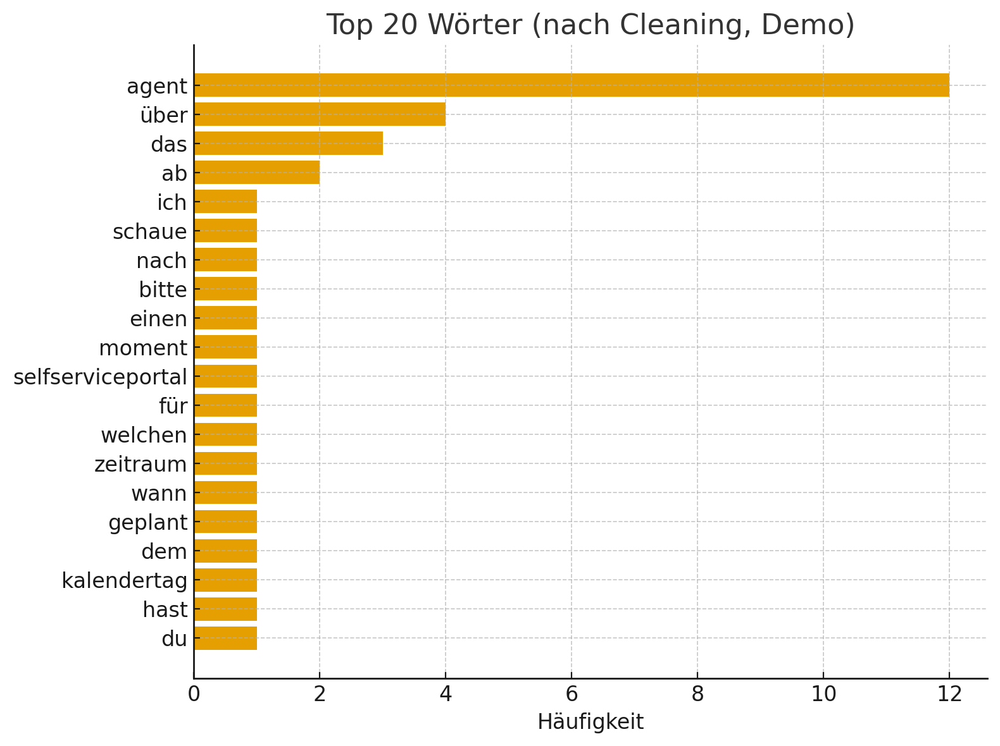
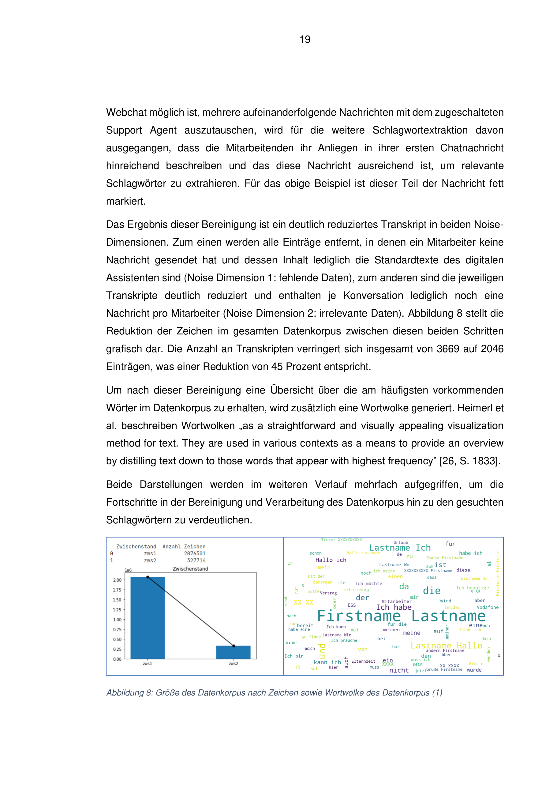

# HR Chat Analytics (Bewerbungs‑Repo)


## Schnellansicht (ohne Code)
- **Projektüberblick:** siehe `docs/Overview.md`
- **Barplots (Zwischenstände):**
  - 
  - 
  - 
- **Top‑20‑Wörter (ohne spaCy):**
  - 
- **Wortwolken (SVG):**
  - 
  - 
  - 
  - 

Die Balkendiagramme zeigen, wie häufig einzelne Themen in den Chat‑Zwischenständen auftreten; hohe Balken weisen auf wiederkehrende Anliegen hin. Die Wortwolken visualisieren dieselben Daten als Cluster aus Schlüsselbegriffen – je größer das Wort, desto öfter wurde es genannt. Gemeinsam machen die Grafiken sichtbar, welche HR‑Themen die Nutzer besonders beschäftigen und liefern Ansatzpunkte für zielgerichtete Verbesserungen.


## Projektbeschreibung & Ergebnisse
Dieses Projekt analysiert HR‑Webchat‑Daten, um wiederkehrende Anliegen in Bewerbungsprozessen zu identifizieren. Die Chats werden bereinigt, tokenisiert und in mehreren Zwischenständen ausgewertet. Häufig genannte Themen drehen sich um Bewerbungsstatus, Vertragsunterlagen, Benefits und Feedbackprozesse. Die Ergebnisse helfen HR‑Teams, Informationslücken zu schließen und Anfragen effizienter zu bearbeiten. Weitere Details stehen in `docs/Summary.md`.


## Hinweis für Reviewer (Python-Skills & Reproduzierbarkeit)
- **Vollständige Originaldatenaufbereitung:** siehe [`src/advanced_pipeline.py`](src/advanced_pipeline.py) – entspricht dem gelieferten Skript.
- **Demo‑Daten:** synthetisches Beispiel unter `data/conversations_example.csv` (DSGVO‑konform).
```bash
pip install -r requirements.txt
python src/pipeline.py
```
Ergebnisse erscheinen in `results/`.


## How to run (Demo)
```bash
pip install -r requirements.txt
python src/pipeline.py
```

## Kurzüberblick
**HR‑Webchat → sauberes Korpus → Visualisierung → ML‑Case Routing.**  
Beispiel‑Wortwolke (zws1/zws2):



Mehr in **docs/Overview.md** (Kurzfassung) und **docs/Summary.md** (Detail).
