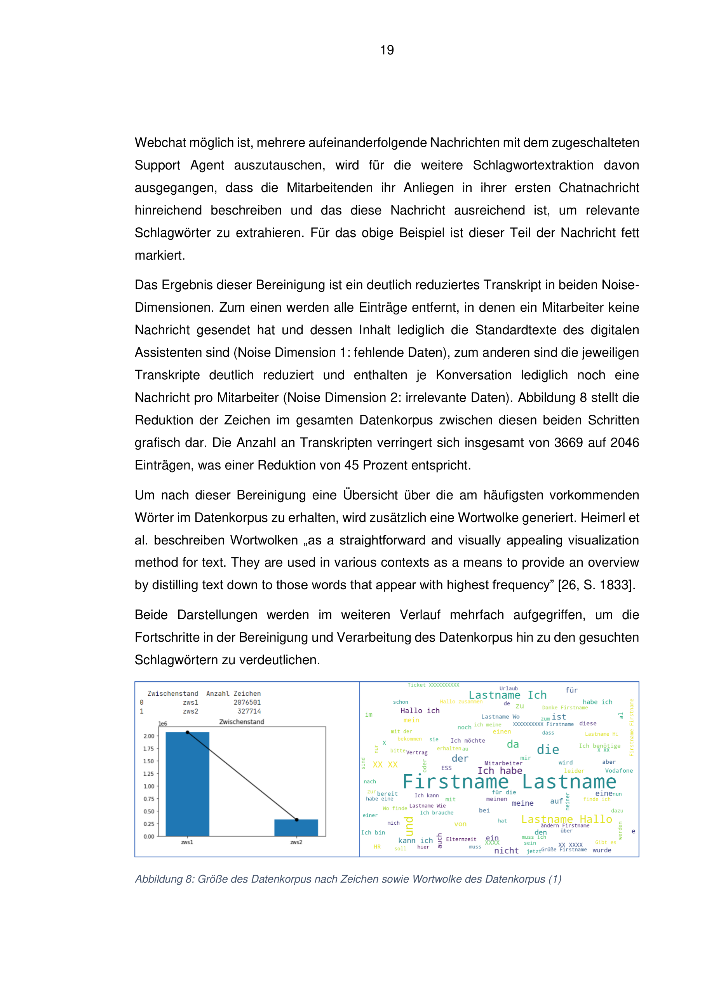
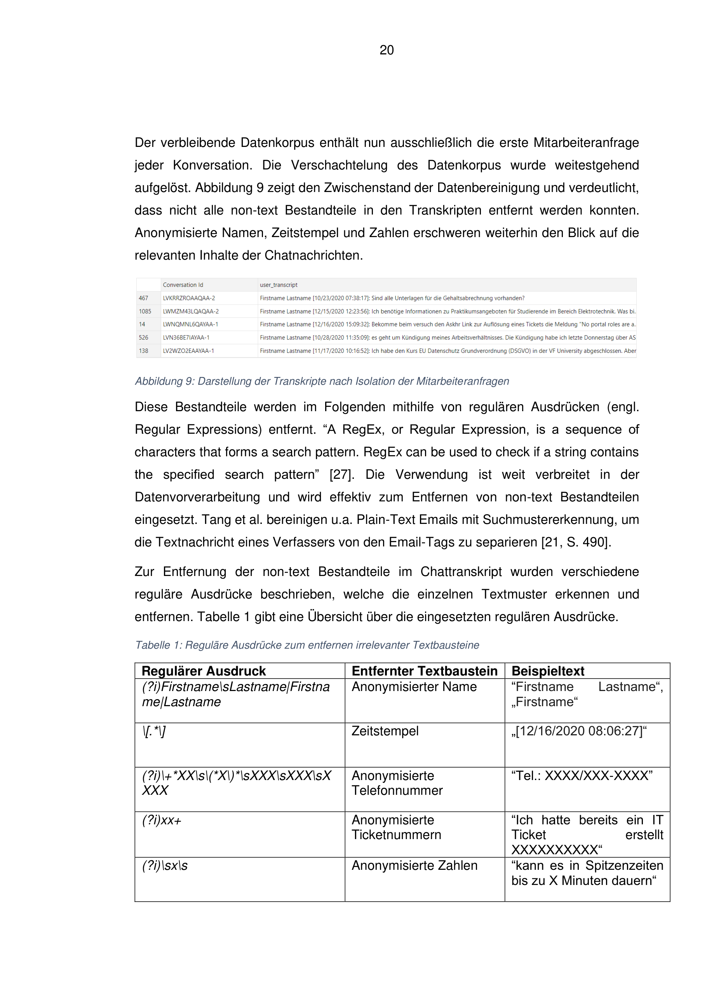

# Projektüberblick – HR Chat Analytics

Dieses Projekt zeigt, wie sich aus **ungefilterten HR‑Webchat‑Dialogen** ein sauberes, verständliches **Textkorpus** erzeugen lässt – als Grundlage für **Automatisierung** und **Case Routing mit Machine Learning**.

## Kerngedanke
- **Problem:** HR‑Chatlogs enthalten viele irrelevante Elemente (Bot‑Texte, Platzhalter, Zeitstempel, Füllwörter).
- **Lösung:** Eine Python‑Pipeline bereinigt die Daten schrittweise (zws1–zws4) und fokussiert die **erste Mitarbeiteranfrage**.
- **Ergebnis:** Visualisierungen (Barplots, Wortwolken) machen Fortschritt und Themencluster für Fachfremde verständlich.
- **Business‑Wert:** Mit dem bereinigten Korpus lässt sich **automatisiertes Case Routing** per Machine Learning umsetzen.

## Beispiel‑Abbildungen
- zws1/zws2 Wortwolken (Fortschritt nach Bot‑Filterung und Fokussierung):  
  
- Barplot (Textumfang schrumpft, Fokus steigt):  
  

👉 Details und weitere Ergebnisse siehe [Summary.md](Summary.md)
