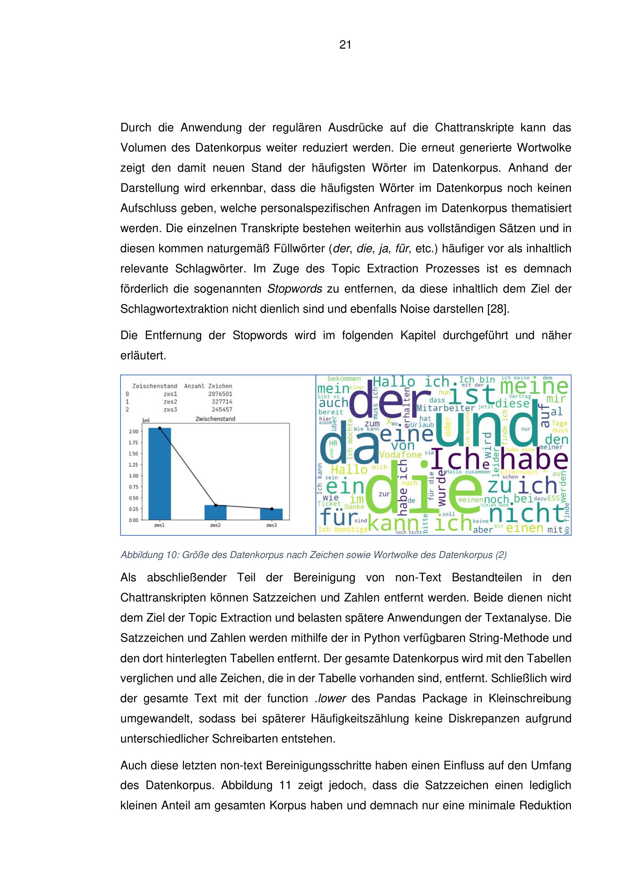
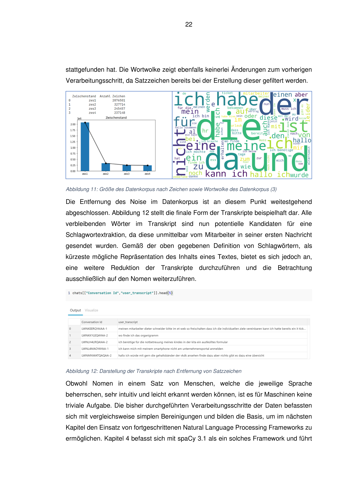
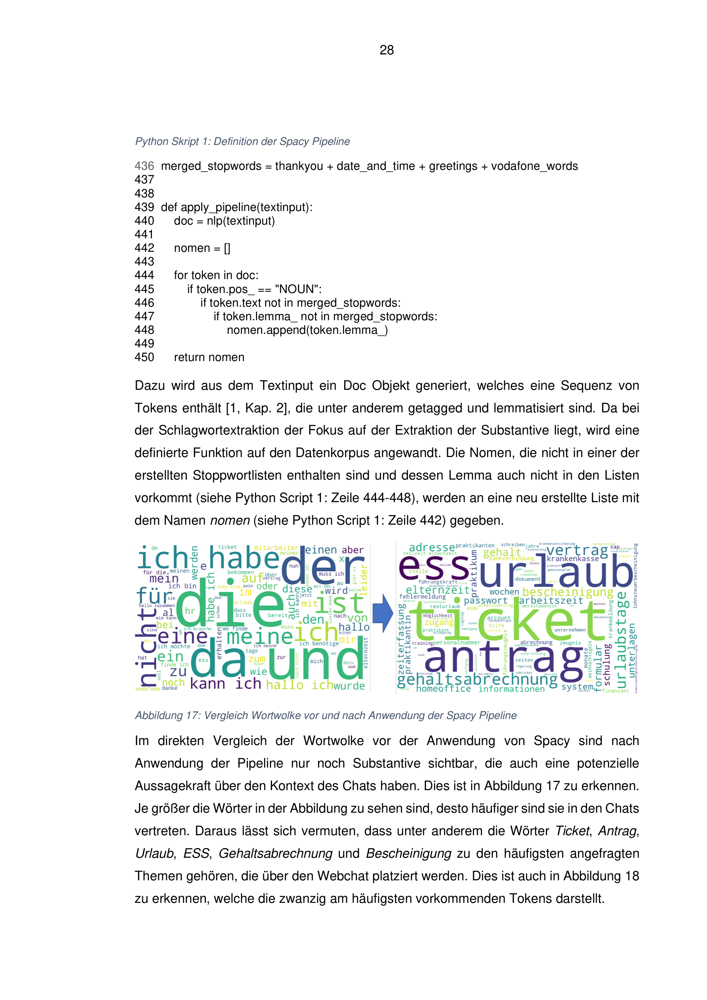

# Projektzusammenfassung – HR Chat Analytics

## Ausgangslage
Im HR‑Webchat stellen Mitarbeitende Anfragen zu Themen wie **Gehalt, Urlaub, Vertrag, Arbeitszeit** oder **Benefits**.  
Die Rohdaten enthalten jedoch viel **Rauschen**: Bot‑Texte (TOBi), Zeitstempel, anonymisierte Namen, Telefonnummern und Platzhalter („xx“).  
Für eine automatische Weiterleitung („Case Routing“) sind diese Daten zunächst **ungeeignet**.

## Zielsetzung
1. **Datenaufbereitung**  
   - Entfernen irrelevanter Inhalte und Platzhalter  
   - Isolieren der **ersten vollständigen Mitarbeiteranfrage**  
   - Normalisieren (Kleinschreibung, keine Ziffern/Satzzeichen)  

2. **Transparenz**  
   - Dokumentation des Fortschritts über vier Bereinigungsstufen (**zws1–zws4**)  
   - Visualisierung per **Barplots** und **Wortwolken**  

3. **Bewertung der Eignung für Machine Learning**  
   - Prüfen, ob das bereinigte Korpus für **automatisches Case Routing** (z. B. Payroll, Urlaub, Vertrag) nutzbar ist

## Vorgehen (zws1–zws4)
- **zws1:** Alle Chatpassagen nach Bot‑Filterung → erste Wortwolken  
  

- **zws2:** Fokussierung auf die erste Mitarbeiteranfrage → Textumfang reduziert  
  

- **zws3:** Regex‑Cleaning (Entfernung von Namen, Telefonnummern, Zeitstempeln, „xx“) → weitere Schärfung  
  

- **zws4:** Normalisierung (lowercase, ohne Satzzeichen/Ziffern) → konsistentes Korpus  
  

## Erweiterung: spaCy‑Analyse
- Nutzung deutscher spaCy‑Modelle (`de_core_news_sm`/`md`)  
- POS‑Tagging: Fokus auf **Nomen** als Träger der Kerninhalte  
- Einbindung von **domänenspezifischen Stopplisten** (Begrüßungen, Höflichkeitsformen, Vodafone‑Termini, Datumsangaben)  
  

## Ergebnisse
- **Rauschen reduziert, Kernanliegen sichtbar:** Die wichtigsten HR‑Themen treten klar hervor (z. B. *urlaub, vertrag, abrechnung, arbeitszeit*).  
- **Visualisierung verständlich:** Barplots zeigen die Reduktion des Textumfangs; Wortwolken machen Themencluster intuitiv greifbar.  
- **Technischer Outcome:** Ein anonymisiertes, konsistentes Textkorpus, das für Klassifikationsmodelle geeignet ist.

## Bewertung: Eignung für ML‑basiertes Case Routing
- Nach zws4 liegen ausreichend klare Daten vor, um ein **überwachtes ML‑Modell** für Case Routing zu trainieren.  
- Potenzielle Klassen: *Payroll, Urlaub, Vertrag, IT‑Support, Benefits*.  
- Empfehlung: Start mit einfachen Modellen (Logistic Regression, SVM), anschließend Evaluierung moderner Sprachmodelle (BERT‑Derivate für Deutsch).  
- **Limitationen:** Für robuste Modelle sind ausreichend **gelabelte Daten** und ggf. **Data Augmentation** erforderlich.

## Bewerbungsrelevanz
- **Python‑Skills:** Pandas, Regex‑Cleaning, Matplotlib, Wordcloud, spaCy  
- **End‑to‑End‑Denken:** Von Rohdaten bis zur ML‑Readiness  
- **Business Impact:** Grundlage für **effizientes HR‑Case Routing**, reduzierte Bearbeitungszeit, bessere Employee Experience
